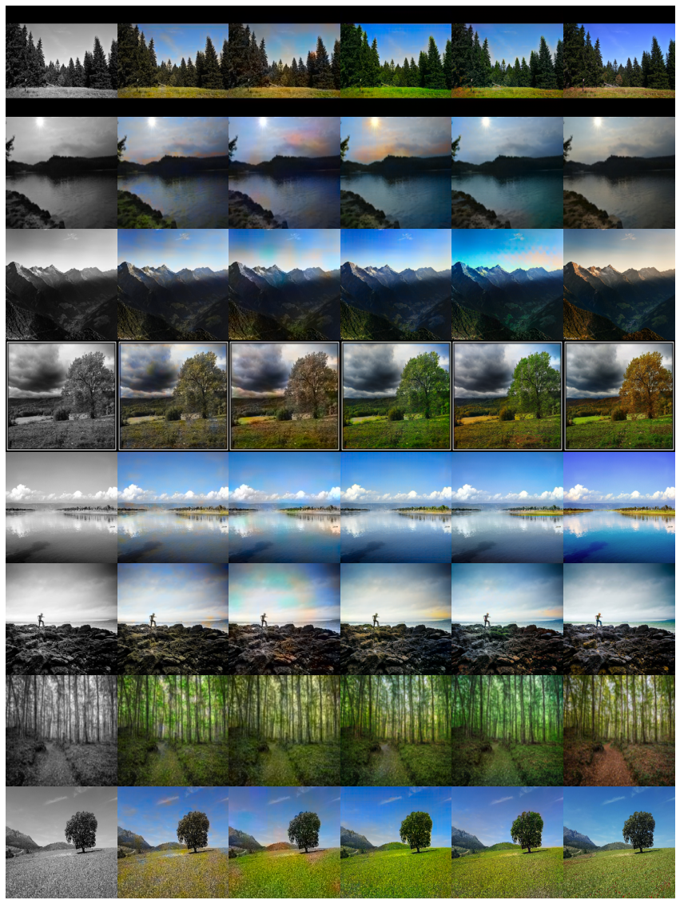
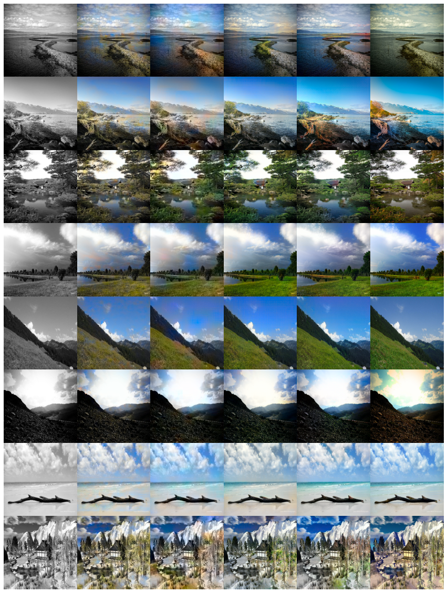

# Colorize Black and White Images Using Deep Learning

Manual colorization of black and white images is a laborious task and inefficient. It has been attempted using Photoshop editing, but it proves to be impractical as it requires extensive research and a picture can take up to one month to colorize. A pragmatic approach to the task is to implement sophisticated image colorization techniques. We attempt to implement image colorization using various CNN and GAN models while leveraging pre-trained models for better feature extraction. 

### Requirements
```
pip install -r requirements.txt
```
### Dataset

The dataset contains 7200 images and was created by collecting nature and landscape images from different stock photo sites. The images were mostly restricted to scenes like beaches, forests, fields, lakes, waterfalls and mountains, but some images from others scenes are also included.
Download the dataset [here](https://drive.google.com/file/d/1tVVF8ttuJ1860epOBDc3OGI3fvS-d9Hy/view?usp=sharing).

### Notebooks

`colorisation_cnn_simple.ipynb` - Code for training baseline CNN and Inception-resnetv2 based model

`pix2pix_training` - Code for training Pix2pix GAN with pretrained MobilenetV2 and Densenet121 based generator

`pix2pix_inference` - Code for inference and evaluation of Pix2pix models

`tflite_conversion` - Code for conversion of Pix2pix model to TFLite with Float16 Quantization

### Results

|Model | MSE | PSNR (dB) | Average inference time (ms)  |
| --- | :---: | :---: | :---: |
|Baseline CNN| 0.0120 | 26.443 | ~56 | 
|Inception-resnetv2 based CNN| 0.0121 | 26.630 | ~159 |
|Pix2pix-Mobilenetv2 (LAB) | 0.0107 | 26.870 | ~61 | 
|Pix2pix-Densenet121 (LAB) | 0.0108 | 26.872 | ~117 |
|Pix2pix-Mobilenetv2 (RGB) | 0.0289 | 22.59 | ~53 |
|Pix2pix-Densenet121 (RGB) | 0.0237 | 23.725 | ~103 |

(1) Grayscale (2) Our custom CNN (3) Inception- Resnetv2 based (4) Pix2pix with MobilenetV2 (5) Pix2pix with Densenet121 (6) Ground Truth
<p align='center'>  
  
  
</p>

### Contributors

1. Abhishek Kumbhar 
2. Anjaneya Ketkar
3. Guruprasad Bhat
4. Ruchir Attri
5. Sagar Gowda
